# Calculadora Judicial

Aplicação para organizar projetos de recuperação judicial e falência, cadastrar credores, elaborar cálculos financeiros e acompanhar revisão e aprovação. O backend utiliza Django e SQLite; a interface utiliza Vue 3, Quasar e uma identidade visual em preto e azul.

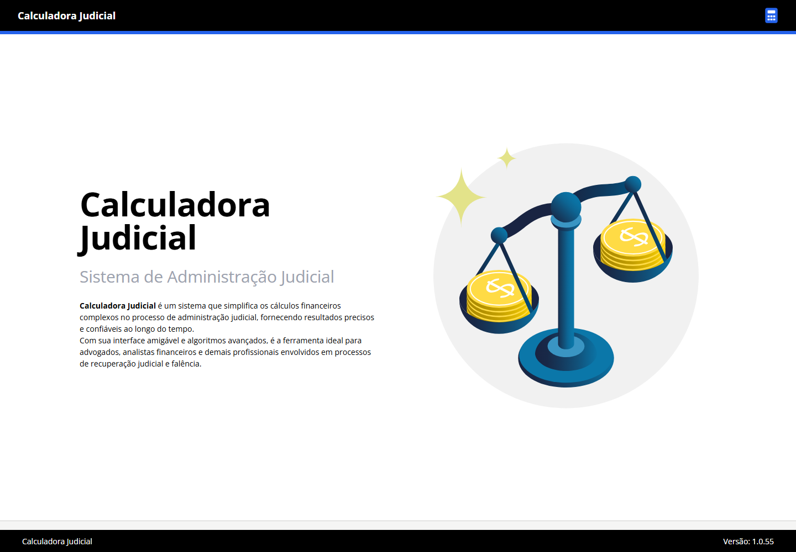

## Índice

- [Funcionalidades](#funcionalidades)
- [Telas e fluxo de trabalho](#telas-e-fluxo-de-trabalho)
- [Arquitetura e estrutura](#arquitetura-e-estrutura)
- [Requisitos](#requisitos)
- [Instalação do backend](#instalação-do-backend)
- [Primeiro acesso e permissões](#primeiro-acesso-e-permissões)
- [Instalação do frontend](#instalação-do-frontend)
- [Configuração dos ambientes](#configuração-dos-ambientes)
- [Índices, templates e tarefas](#índices-templates-e-tarefas)
- [API e endereços](#api-e-endereços)
- [Build e publicação](#build-e-publicação)
- [Banco, arquivos e backup](#banco-arquivos-e-backup)
- [Verificação e solução de problemas](#verificação-e-solução-de-problemas)
- [Atualização das capturas](#atualização-das-capturas)

## Funcionalidades

| Módulo | Finalidade |
| --- | --- |
| Projetos | Cadastrar processos, datas, responsáveis, recuperandas e participantes. |
| Indicadores | Consultar status dos projetos, fases dos cálculos, credores e valores consolidados. |
| Credores | Cadastrar e editar pessoas físicas e jurídicas, consultar créditos e importar planilhas. |
| Cálculos | Configurar critérios, créditos e verbas, comparar valores e acompanhar o fluxo de aprovação. |
| Extrato contábil | Consultar demonstrativos e solicitar exportações em XLSX e PDF. |
| Time | Consultar usuários, equipes, projetos e solicitações de acesso conforme as permissões. |
| Administração | Gerenciar os registros pela área administrativa do Django. |


### 1. Início e acesso

A tela inicial apresenta a ferramenta e as ações de acesso. O botão **Entrar** depende do estado de autenticação e ativação do usuário. Em instalações com SSO, usuários sem autorização podem solicitar acesso aos responsáveis configurados.

O cabeçalho mostra **Calculadora Judicial** à esquerda e o ícone de calculadora à direita.


### 2. Projetos e indicadores

O menu **Projetos** reúne os indicadores e a lista de processos. É possível pesquisar por nome, número do processo ou status, ordenar a tabela e alterar a quantidade de registros por página. Clique em uma linha para abrir o projeto. O botão **Novo Projeto** aparece para usuários com a permissão de cadastro.

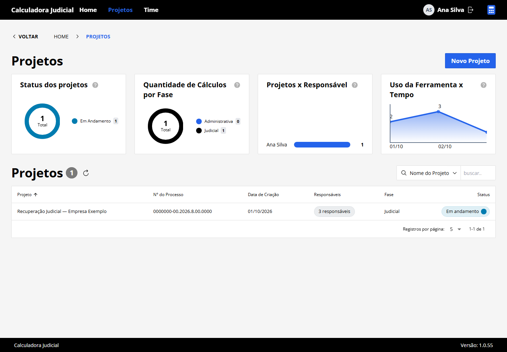

### 3. Time e permissões

O menu **Time** oferece os modos **Pessoas** e **Projetos**. A visão de pessoas mostra usuários, e-mails, grupos, cargos e ativação. A visão de projetos organiza os participantes por processo. As ações de editar usuários e tratar solicitações dependem das permissões de autorização.

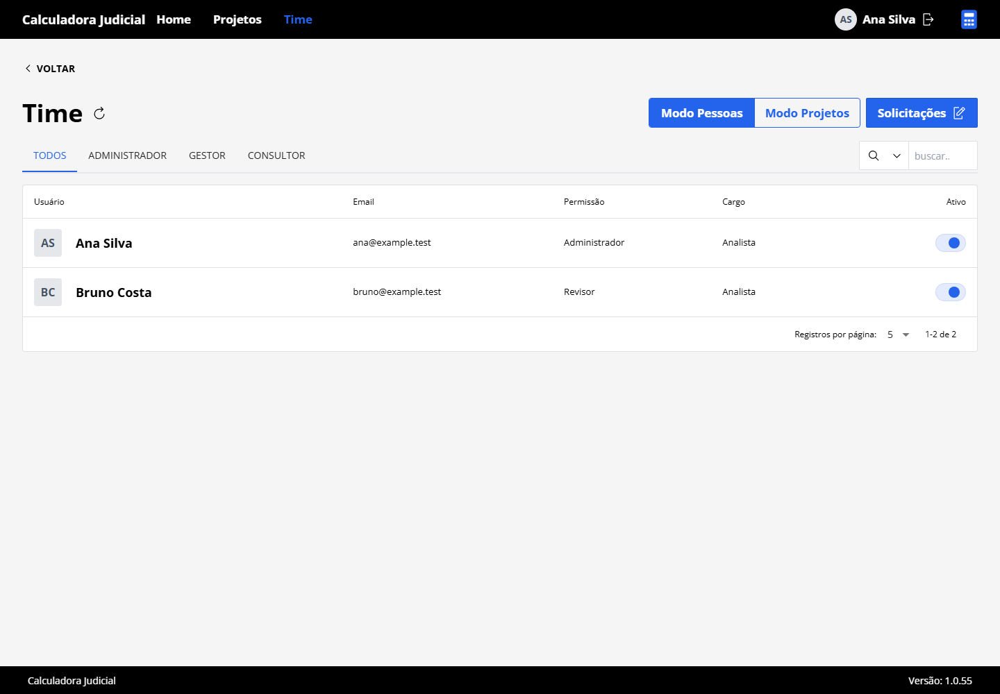

### 4. Detalhes do projeto

A página do projeto apresenta responsáveis, dados processuais, recuperandas e indicadores de credores e cálculos. Use **Participantes** para consultar a equipe e **Editar** para atualizar os dados quando autorizado. Expanda uma recuperanda para consultar seus credores e acessar os cálculos associados.

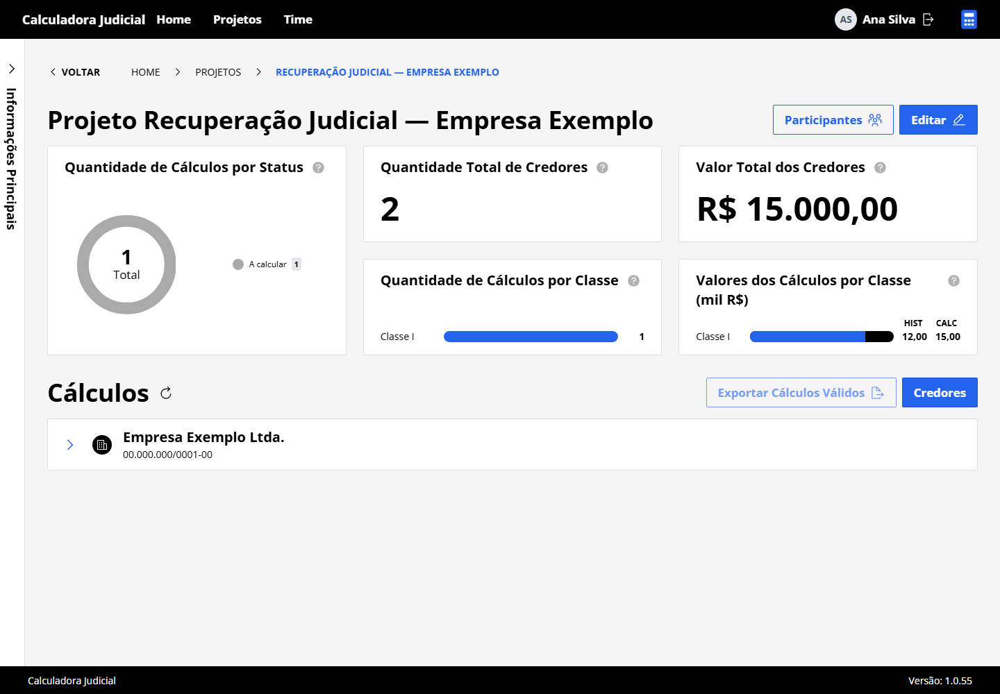

### 5. Credores

Na página **Credores**, expanda a recuperanda desejada. A tabela mostra nome, CPF/CNPJ e tipo de pessoa, com pesquisa e paginação. As ações **Novo Credor**, **Editar Credor** e **Carregar Credores** dependem das permissões do usuário.

Na importação, use o modelo disponibilizado pela própria tela e acompanhe a aba **Histórico**. O processamento depende dos serviços de tarefas e dos templates disponíveis na instalação.

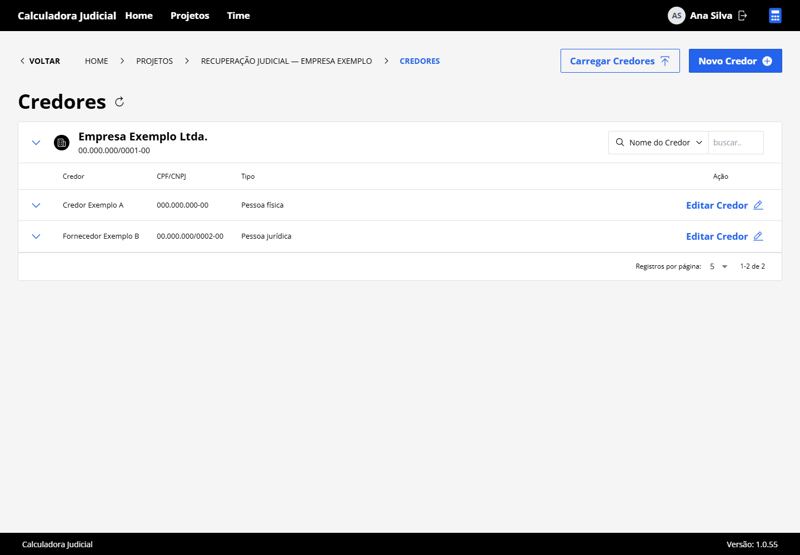

### 6. Cálculo e extrato contábil

A tela do cálculo reúne o credor, o status, os créditos e os totais históricos e calculados. Use **Editar Cálculo** para ajustar os parâmetros e **Novo Crédito** para incluir os itens disponíveis nos templates. A aba **Extrato Contábil** apresenta os demonstrativos e as ações de exportação.

A captura abaixo mostra um cálculo recém-aberto, ainda sem créditos.

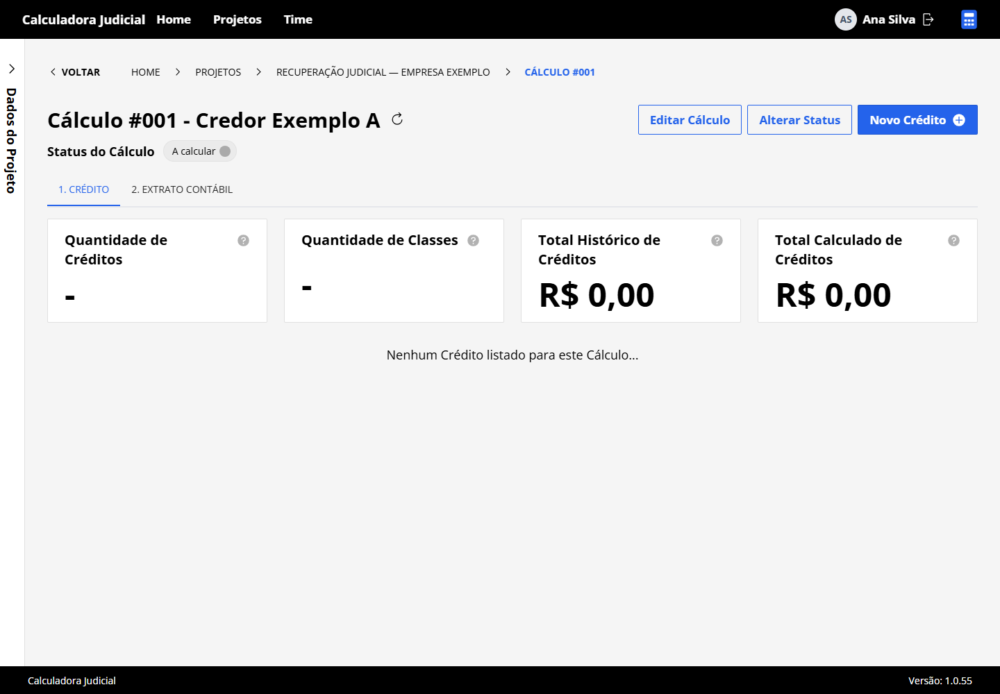

O fluxo definido nos modelos utiliza estas etapas:

| Código | Etapa | Papel associado |
| --- | --- | --- |
| `S` | A calcular | Executor |
| `C` | A revisar | Revisor |
| `E` | A aprovar | Aprovador |
| `B` | Aprovação especial | Aprovador especial |
| `A` | Finalizado | Cálculo aprovado |

As transições são verificadas pelo backend e dependem do papel do usuário, da participação no projeto e dos dados do cálculo. A aprovação especial é utilizada quando aplicável.

### 7. Novo crédito

Na tela do cálculo, clique em **Novo Crédito**. Selecione a classe, o tipo de crédito, a moeda e o índice disponíveis. O tipo escolhido determina os campos adicionais do formulário. Preencha os campos obrigatórios e confirme a criação para vincular o crédito ao cálculo.

Os tipos e campos são carregados dos templates cadastrados no backend; uma instalação sem templates pode apresentar listas vazias.

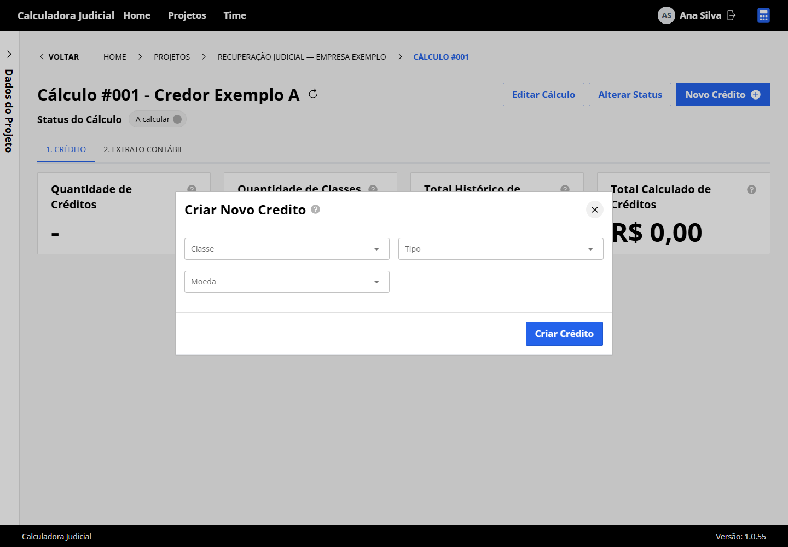

### 8. Editar cálculo

Clique em **Editar Cálculo** para consultar e ajustar os parâmetros do cálculo existente. O formulário reúne o tipo de cálculo, os dados do crédito, incidente e demais opções aplicáveis. Confira os pleitos e critérios antes de salvar; o formulário verifica os campos obrigatórios e as regras correspondentes ao tipo selecionado.

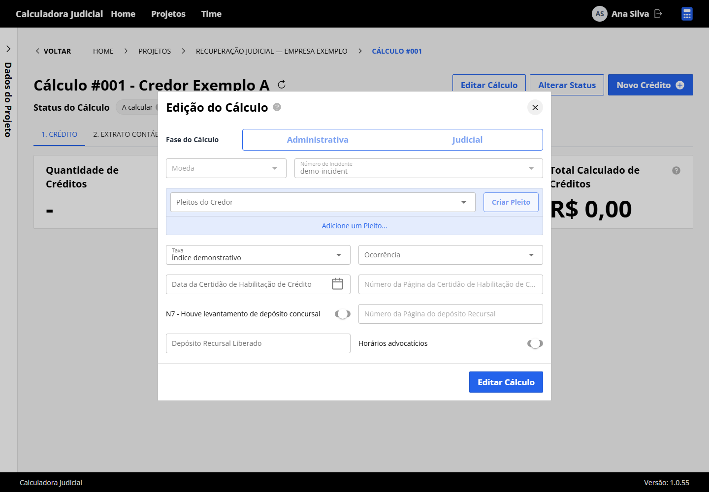

### 9. Alterar status

O botão **Alterar Status** abre inicialmente o histórico do cálculo. Dentro dessa janela, clique em **Alterar Status** para acessar o fluxo de etapas, selecionar o destino em **Enviar para Status** e registrar um comentário.

A lista de destinos é filtrada pelas permissões e validações da API. Quando o destino exige aprovação especial, informe também os aprovadores correspondentes. A imagem apresenta o formulário antes da confirmação da transição.

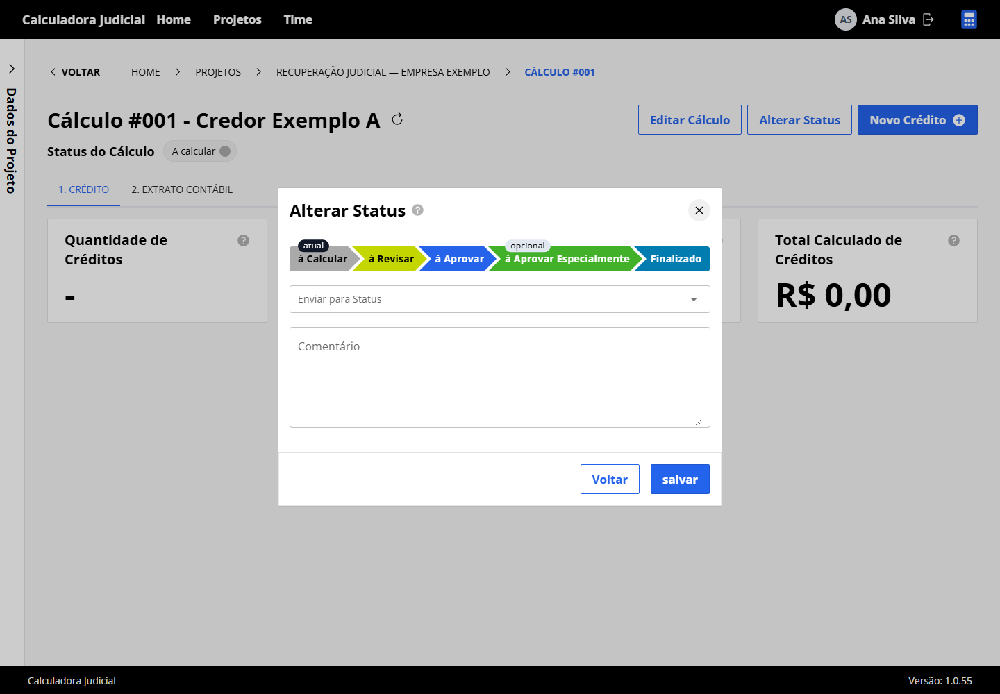

### 10. Novo credor

Na página **Credores**, clique em **Novo Credor**. Informe nome, CPF/CNPJ, descrição e as recuperandas às quais o cadastro será vinculado. Confirme em **Cadastrar** e confira o novo registro na listagem da recuperanda escolhida.

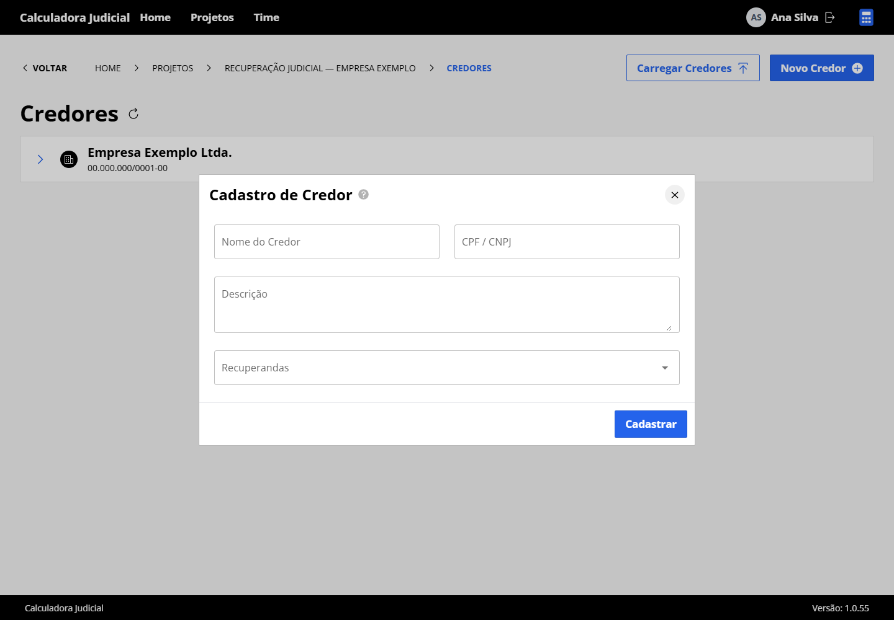

### 11. Carregar credores

Clique em **Carregar Credores** para abrir a importação em massa. Baixe o template disponibilizado na janela, preencha a planilha conforme o modelo e selecione o arquivo para processamento. Utilize a aba **Histórico** para consultar os carregamentos e seus resultados.

A captura utiliza um nome de arquivo demonstrativo; não executa upload nem processamento. Na instalação real, a disponibilidade dos modelos e o processamento dependem do backend e dos serviços de tarefas.

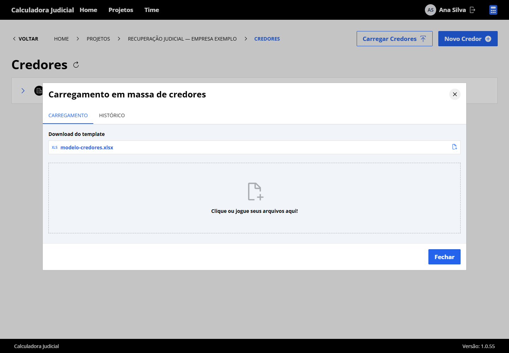

### 12. Editar projeto

Na página do projeto, clique em **Editar**. A janela carrega os dados atuais e organiza a edição em etapas, incluindo informações principais, responsáveis e times e papéis. Revise os campos de cada etapa antes de concluir. O botão exige a permissão `change_project`.

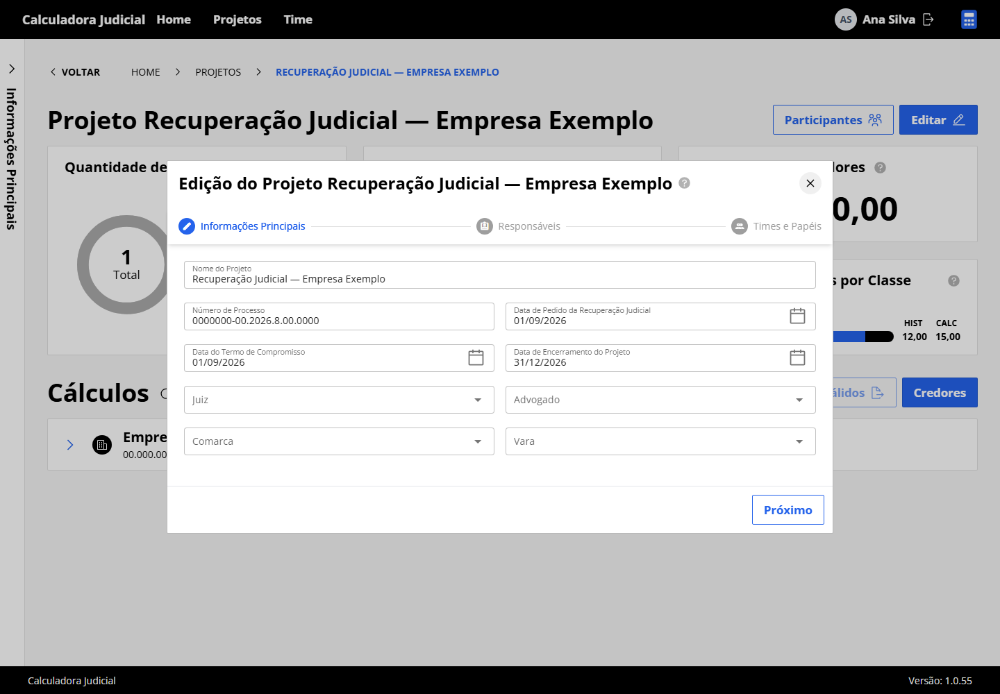

### 13. Participantes

Clique em **Participantes** na página do projeto para consultar a equipe agrupada por função: executores, revisores, aprovadores e aprovadores especiais. A janela apresenta os vínculos existentes; a atribuição desses papéis é feita no cadastro ou na edição do projeto.

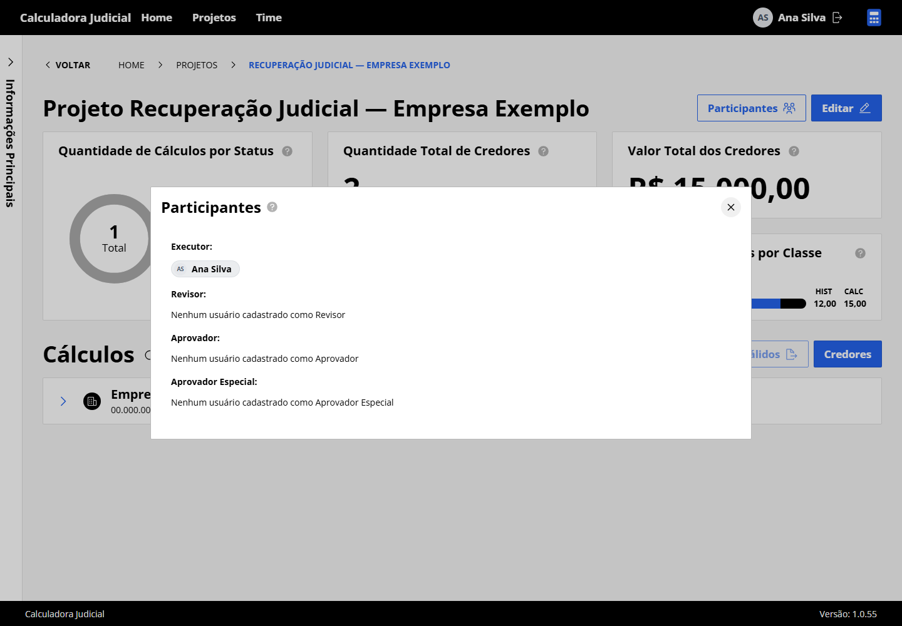

### 14. Novo projeto

Na listagem **Projetos**, clique em **Novo Projeto**. O cadastro possui quatro etapas: **Informações Principais**, **Recuperandas**, **Responsáveis** e **Times e Papéis**. Informe os dados processuais, associe as recuperandas e escolha os responsáveis e participantes. Use **Próximo** e **Anterior** para navegar e **Concluir** para finalizar após resolver os campos obrigatórios.

A captura mostra a primeira etapa do assistente. O botão de cadastro exige a permissão `add_project`.

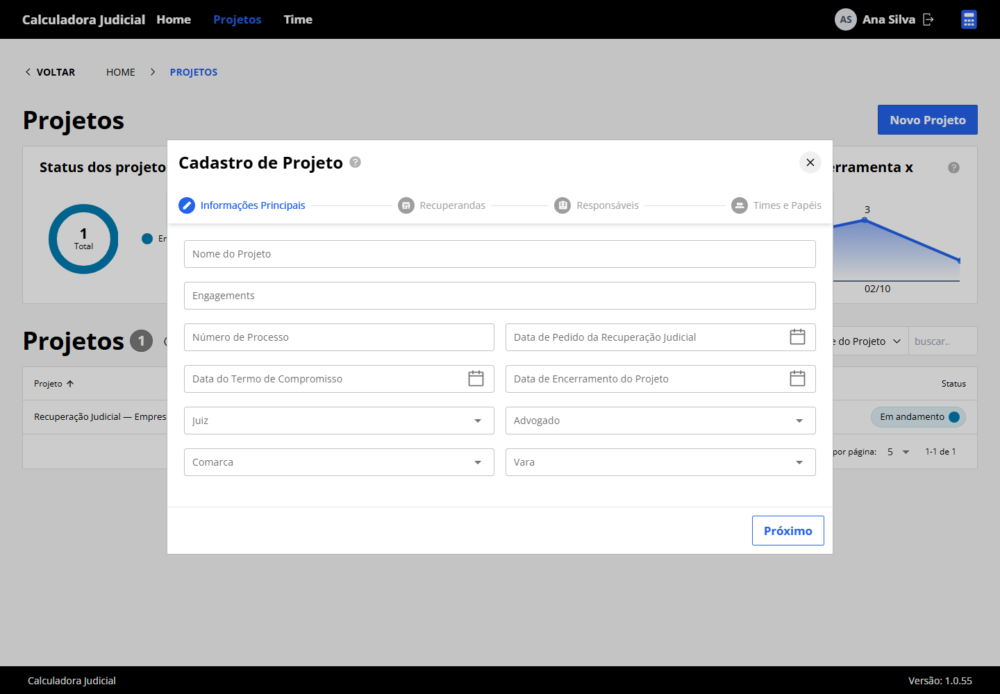

### Sequência de uso

1. Ative o usuário e atribua seus grupos e permissões.
2. Cadastre um projeto com o processo, as datas, os responsáveis e as recuperandas.
3. Defina os participantes responsáveis pela execução, revisão e aprovação.
4. Cadastre ou importe os credores de cada recuperanda.
5. Abra o cálculo, configure os critérios e inclua os créditos.
6. Confira os valores e encaminhe o cálculo pelas etapas permitidas.
7. Consulte o extrato contábil e exporte os documentos necessários.

## Arquitetura e estrutura

```text
Navegador → Vue / Quasar → API Django → SQLite
                                ├── arquivos em media/
                                └── tarefas / Celery / Redis
```

| Diretório | Conteúdo |
| --- | --- |
| `backend/config/` | Configurações, rotas, inicialização Django e Celery. |
| `backend/core/` | Usuários, autenticação, permissões e componentes compartilhados. |
| `backend/projects/` | Projetos, equipes e dados processuais. |
| `backend/creditors/` e `backend/recovering/` | Credores, classes, editais e recuperandas. |
| `backend/calculation/` | Critérios, créditos, verbas, comparativos e demonstrativos. |
| `backend/rates/` | Índices, séries, regras e templates dos cálculos. |
| `backend/file/` e `backend/templates/` | Processamento de arquivos e modelos de documentos. |
| `frontend/src/pages/` | Páginas e rotas geradas a partir dos arquivos Vue. |
| `frontend/src/components/` | Componentes da interface. |
| `frontend/src/services/` e `frontend/src/stores/` | Comunicação com a API e estado da sessão. |
| `frontend/public/` | Ícones, logotipos e ilustrações. |
| `docs/screenshots/` | Capturas e script para reproduzi-las. |

## Requisitos

- Python 3.10 ou 3.11 para trabalhar com as versões antigas fixadas nas dependências.
- Node.js e pnpm. As capturas desta documentação foram geradas com Node.js 22 e pnpm 9.
- Git e um navegador atualizado.
- Redis e um worker Celery para os recursos que utilizam processamento assíncrono.

SQLite utiliza o suporte nativo do Python: não é necessário instalar um servidor de banco separado. O caminho do arquivo precisa estar em um diretório existente e gravável.

As instruções abaixo usam PowerShell e partem da raiz do repositório. No Linux/macOS, ative o ambiente Python com `source .venv/bin/activate` e utilize `cp` no lugar de `Copy-Item`.

## Instalação do backend

### Ambiente Python

```powershell
cd backend
python -m venv .venv
.\.venv\Scripts\Activate.ps1
python -m pip install --upgrade pip
pip install "Django>=4.2,<5" "numpy<2" -r requirements_base.txt
Copy-Item .env.example .env
```

O código foi escrito para a família Django 4.2. As restrições acima evitam instalar automaticamente uma versão principal mais recente do Django ou NumPy junto às dependências antigas, como pandas 2.0.1. O arquivo `requirements.txt` contém um conjunto mais amplo de ferramentas; `requirements_base.txt` é o ponto de partida para executar a aplicação.

### Chaves e configuração

Gere os valores localmente:

```powershell
python -c "import secrets; print(secrets.token_urlsafe(50))"
python -c "from cryptography.fernet import Fernet; print(Fernet.generate_key().decode())"
python -c "import secrets; print(secrets.token_hex(32))"
```

Use os resultados, respectivamente, em `SECRET_KEY`, `FERNET_KEY` e `FIELD_HASH_KEY` no arquivo `backend/.env`. Mantenha as chaves de criptografia ao reutilizar um banco existente; alterá-las pode impedir a leitura dos dados criptografados.

```dotenv
ENVIRONMENT=dev
DEBUG=True
SECRET_KEY=SUBSTITUA_PELA_CHAVE_GERADA
FERNET_KEY=SUBSTITUA_PELA_CHAVE_FERNET
FIELD_HASH_KEY=SUBSTITUA_PELA_CHAVE_HEXADECIMAL
ENABLE_SSO=False
ENABLE_TOKEN=True
ENABLE_DRF=True
SQLITE_PATH=db.sqlite3
SQLITE_TIMEOUT=60
ALLOWED_HOSTS=localhost,127.0.0.1
CSRF_TRUSTED_ORIGINS=http://localhost:8000,https://localhost:5173
REDIS_URL=redis://127.0.0.1:6379
```

### Banco e permissões

Execute dentro de `backend`, com o ambiente Python ativado:

```powershell
python manage.py makemigrations
python manage.py migrate
python manage.py create_permissions
python manage.py create_groups
python manage.py check
```

Os diretórios de migração dos módulos estão inicialmente vazios neste repositório. Por isso, gere as migrações antes de criar um banco novo. Registre as migrações geradas no controle de versão para que outras instalações utilizem o mesmo esquema.

## Primeiro acesso e permissões

O modelo de usuários é personalizado. O comando padrão `createsuperuser` não fornece o fluxo de criação esperado neste projeto. Para criar um administrador de desenvolvimento, abra o shell:

```powershell
python manage.py shell
```

Execute o seguinte código no shell, após criar os grupos:

```python
from getpass import getpass
from django.contrib.auth import get_user_model
from django.contrib.auth.models import Group
from rest_framework.authtoken.models import Token

User = get_user_model()
user, created = User.objects.get_or_create(
    username="admin_local",
    defaults={
        "first_name": "Administrador",
        "email": "admin@example.test",
        "is_active": True,
        "is_staff": True,
        "status": "A",
    },
)
user.set_password(getpass("Senha do administrador local: "))
user.save()
user.groups.add(Group.objects.get(name="Administrador"))
token, _ = Token.objects.get_or_create(user=user)
print(token.key)
```

Esse exemplo cria uma conta com acesso administrativo para desenvolvimento. Para contas existentes, confira também `is_active`, `is_staff` e `status`; os valores de `defaults` só são aplicados na criação. O modelo atual considera usuários ativos com `is_staff=True` como superusuários. Atribua esse atributo apenas às contas administrativas.

Guarde o token para configurar o frontend local. A área administrativa utiliza o usuário e a senha. Tokens de usuários devem ficar apenas em arquivos locais de ambiente, sem serem incluídos em commits ou capturas.

Para iniciar a API:

```powershell
python manage.py runserver 127.0.0.1:8000
```

## Instalação do frontend

Em outro terminal, a partir da raiz do repositório:

```powershell
cd frontend
pnpm install --frozen-lockfile
Copy-Item .env.example .env.devlocal
```

Edite `frontend/.env.devlocal`:

```dotenv
VITE_API_HOST=http://127.0.0.1:8000
VITE_API_BASE_URL=/calculadora-judicial/api
VITE_BASE_URL=https://localhost:5173
VITE_ROUTER_BASE_URL=/calculadora-judicial
VITE_TOKEN=SUBSTITUA_PELO_TOKEN_DO_USUARIO
VITE_LOG=false
VITE_LOG_REQUEST=false
VITE_LOG_RESPONSE=false
```

Use `VITE_API_HOST` **sem barra no final**, pois os serviços concatenam esse endereço com o caminho da API. `VITE_BASE_URL` identifica o endereço do frontend e seus arquivos públicos.

```powershell
pnpm dev:local
```

Acesse `https://localhost:5173/calculadora-judicial/`. O Vite está configurado com HTTPS e `vite-plugin-mkcert`; na primeira execução, a ferramenta pode preparar os certificados locais. Se a porta estiver ocupada e mudar, ajuste `VITE_BASE_URL` e `CSRF_TRUSTED_ORIGINS`. Reinicie os serviços após alterar os arquivos de ambiente.

## Configuração dos ambientes

### Backend

| Variável | Função |
| --- | --- |
| `ENVIRONMENT` | Seleciona `dev`, `hml` ou `prod`. SQLite é utilizado nos três. |
| `DEBUG` | Habilita informações de desenvolvimento; use `False` em produção. |
| `SECRET_KEY` | Chave do Django. |
| `FERNET_KEY` | Chave utilizada pela aplicação para criptografia. |
| `FIELD_HASH_KEY` | Configuração das chaves dos campos criptografados. |
| `SQLITE_PATH` | Arquivo SQLite; relativo a `backend` ou absoluto. Padrão: `db.sqlite3`. |
| `SQLITE_TIMEOUT` | Tempo de espera por bloqueios do banco, em segundos. Padrão: `60`. |
| `ALLOWED_HOSTS` | Hosts permitidos, separados por vírgula e sem protocolo. |
| `CSRF_TRUSTED_ORIGINS` | Origens confiáveis, com protocolo e porta, separadas por vírgula. |
| `ENABLE_SSO` | Ativa a integração de autenticação Microsoft. |
| `ENABLE_TOKEN` | Ativa a autenticação por token e a configuração de CORS correspondente. |
| `ENABLE_DRF` | Ativa o tratamento padronizado de erros da API. |
| `REDIS_URL` | Endereço do Redis para broker e recursos de tarefas. |
| `DEFAULT_FROM_EMAIL` | Remetente usado pelo fluxo de solicitação/autorização. |

O backend aceita arquivos `.env.dev`, `.env.hml` e `.env.prod` com a opção `--env`:

```powershell
python manage.py runserver --env dev
```

O arquivo escolhido precisa existir no diretório de execução e definir `ENVIRONMENT` corretamente. Sem `--env`, o carregamento padrão utiliza `.env`.

### Autenticação Microsoft

Para utilizar SSO, configure `ENABLE_SSO=True`, `MSAL_CLIENT_ID`, `MSAL_CLIENT_SECRET` e `MSAL_TENANT_ID`. Cadastre o endereço de retorno no provedor de identidade conforme as rotas de autenticação da instalação. Para uma instalação exclusivamente por SSO, configure `ENABLE_TOKEN=False`.

### Modos do frontend

| Comando | Arquivo de ambiente do modo | Uso |
| --- | --- | --- |
| `pnpm dev:local` | `.env.devlocal` | Frontend com a API local. |
| `pnpm dev` | `.env.devremote` | Frontend de desenvolvimento com a API configurada para esse modo. |
| `pnpm build:hml` | `.env.homolog` | Build de homologação. |
| `pnpm build:prod` | `.env.production` | Build de produção. |

As variáveis `VITE_*` são incorporadas ao frontend. Não coloque senhas de banco, chaves de criptografia ou credenciais privadas de SSO nesses arquivos. O token fixo é uma configuração de desenvolvimento, vinculada a um usuário.

## Índices, templates e tarefas

Um banco recém-criado não contém automaticamente todos os índices e templates necessários aos cálculos. Os comandos abaixo carregam os cadastros fornecidos pelo repositório, a partir de `backend`:

```powershell
python manage.py create_natures
python manage.py create_rates_by_json
python manage.py create_indices_by_json
python manage.py create_indice_templates
```

Confira o resultado de cada comando antes de continuar. Os arquivos de índices representam os dados incluídos no repositório; valide os períodos e regras necessários ao processo antes de utilizá-los. Há comandos adicionais em `backend/rates/management/commands/`, incluindo importadores de séries e tabelas tributárias; examine suas fontes e parâmetros antes de executá-los.

Para tarefas Celery, inicie o Redis e, em outro terminal com o ambiente Python ativado, execute:

```powershell
cd backend
python -m celery -A config worker --pool=solo --loglevel=INFO -Q default,save-file
```

O pool `solo` permite execução local com baixa concorrência de escrita no SQLite. API e workers devem utilizar o mesmo `.env`, as mesmas chaves e o mesmo arquivo de banco. Parte do código também utiliza Redis Pub/Sub e processadores próprios; acompanhe os logs dos recursos de importação para identificar o serviço requerido.

## API e endereços

| Recurso | Endereço local |
| --- | --- |
| Frontend em desenvolvimento | `https://localhost:5173/calculadora-judicial/` |
| API v1 | `http://127.0.0.1:8000/calculadora-judicial/api/v1/` |
| API v2 | `http://127.0.0.1:8000/calculadora-judicial/api/v2/` |
| Swagger | `http://127.0.0.1:8000/calculadora-judicial/api/v1/docs/swagger/` |
| Redoc/esquema | `http://127.0.0.1:8000/calculadora-judicial/api/v1/docs/redoc/` |
| Administração Django | `http://127.0.0.1:8000/calculadora-judicial/admin/` |

A autenticação por token utiliza o cabeçalho `Authorization: Token <token>`. As respostas podem conter o envelope da aplicação, com `data`, `profile`, `accept_token` e `application_response`; consulte o esquema e os serviços do frontend para o contrato de cada endpoint. As versões v1 e v2 não oferecem necessariamente os mesmos recursos.

## Build e publicação

Configure `frontend/.env.production` para o endereço da instalação. Na execução integrada ao Django, o frontend pode usar a mesma origem da API em `VITE_API_HOST` e `VITE_BASE_URL`.

```powershell
cd frontend
pnpm build:prod
```

O build é gravado em `backend/calculadora-judicial/static/src/vue/dist/`, com a base pública `/calculadora-judicial/static/src/vue/dist/`.

Depois, dentro de `backend` e com o ambiente Python ativado:

```powershell
python manage.py migrate
python manage.py createcachetable
python manage.py collectstatic --noinput
```

O cache de produção utiliza uma tabela no banco. Configure `ENVIRONMENT=prod`, `DEBUG=False`, os hosts, as origens e as chaves próprias da instalação. Sirva o Django por um servidor WSGI/ASGI e configure o servidor web para os arquivos estáticos e os uploads. O `runserver` é utilizado apenas para desenvolvimento.

## Banco, arquivos e backup

- O banco padrão fica em `backend/db.sqlite3`; `SQLITE_PATH` permite escolher outro arquivo.
- Uploads ficam em `backend/media/` e precisam de backup separado.
- Os arquivos estáticos coletados ficam em `backend/var/static_root/`.
- O diretório do banco deve existir. Todos os processos precisam de acesso de leitura e escrita.
- SQLite permite vários leitores, mas serializa as gravações. Reduza a concorrência de workers quando houver bloqueios frequentes.

Para fazer um backup consistente do arquivo padrão, execute dentro de `backend`:

```powershell
python -c "import sqlite3; source=sqlite3.connect('db.sqlite3'); target=sqlite3.connect('db.backup.sqlite3'); source.backup(target); target.close(); source.close()"
```

Se `SQLITE_PATH` foi personalizado, substitua o caminho de origem. Preserve também os uploads e as chaves necessárias para ler os dados.

### Importação de bancos antigos

As alterações de banco e de identidade não transferem dados automaticamente. Os clientes e exportações anteriores precisam considerar o aplicativo `users`, os campos comparativos `system`, o envelope `application_response` e o prefixo de URLs `/calculadora-judicial/`.

Faça a transferência em uma cópia de trabalho: crie o esquema de destino, adapte os nomes, importe os registros e confira relacionamentos, contagens, documentos e cálculos antes de utilizar o banco na instalação principal.

## Verificação e solução de problemas

### Comandos disponíveis

```powershell
# Dentro de backend, com o ambiente Python ativado
python manage.py check
python manage.py showmigrations
python manage.py test
```

```powershell
# Dentro de frontend
pnpm ts
pnpm lint
pnpm exec vitest run
pnpm build:prod
```

Os testes do backend utilizam um banco separado, sem espelhar o arquivo da aplicação. Leia as configurações dos testes antes de habilitar integrações externas.

| Sintoma | O que verificar |
| --- | --- |
| `ModuleNotFoundError` | Ambiente Python ativado e instalação de `requirements_base.txt`. |
| Erro em `FERNET_KEY` | Chave preenchida no `.env`, gerada pelo comando indicado. |
| `no such table` | Migrações geradas e aplicadas no arquivo selecionado por `SQLITE_PATH`. |
| `unable to open database file` | Diretório existente e permissões do arquivo e da pasta. |
| `database is locked` | Escritas concorrentes; reduza workers e confira o timeout. |
| Erros 401/403 | Token, ativação do usuário, grupos e participação no projeto. |
| Menu Time ou botões ausentes | Permissões como `view_user`, `add_project` e `can_authorize_users`. |
| Erro CORS/CSRF | Protocolo, host e porta do frontend nas configurações do backend. |
| Tela vazia ou arquivos 404 | Base da aplicação, variáveis `VITE_*`, build e configuração de estáticos. |
| Template ou índice ausente | Carga dos cadastros e períodos disponíveis no banco. |
| Importação pendente | Redis, workers, filas e logs do processamento. |
| Ícone ou nome desatualizado | Novo build, arquivos estáticos atualizados e cache do navegador. |
